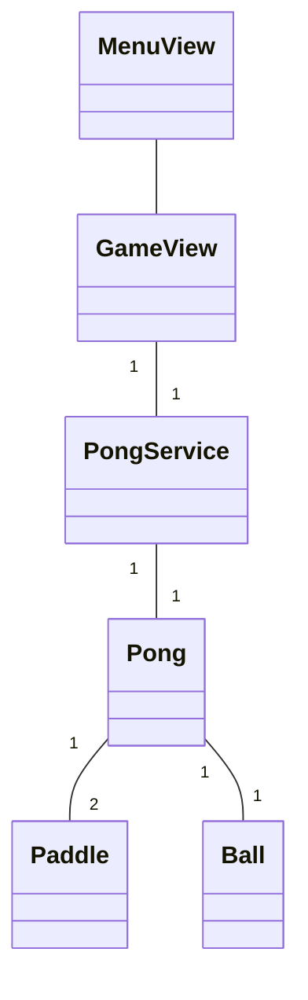

# Arkkitehtuuridokumentti

## Luokkakaavio

Ohjelman valikko ja pelinäkymä on toteutettu omina luokkinaan. Pelin tietosisältö on luokissa Pong, Paddle ja Ball, joiden tietoja luokka PongService lukee ja muokkaa. PongService-luokka tarjoaa metodit, joilla käyttöliittymäluokka GameView ohjaa pelaajan mailaa sekä hakee tiedot pelin tilasta.

## Sekvenssikaavio

Alla oleva sekvenssikaavio kuvaa GameView-luokassa olevan pelisilmukan toimintaa yhden kierroksen aikana. Tässä esimerkissä pelaaja painaa nuolta alaspäin. Esimerkistä on luettavuuden takia jätetty pois tietokoneen mailan siirron ja pallon mahdollisten kimpoamisten yksityiskohtainen käsittely, sillä nämä sisältävät useita muuttujien arvojen lukemisia.

