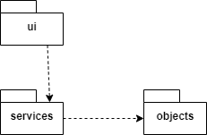
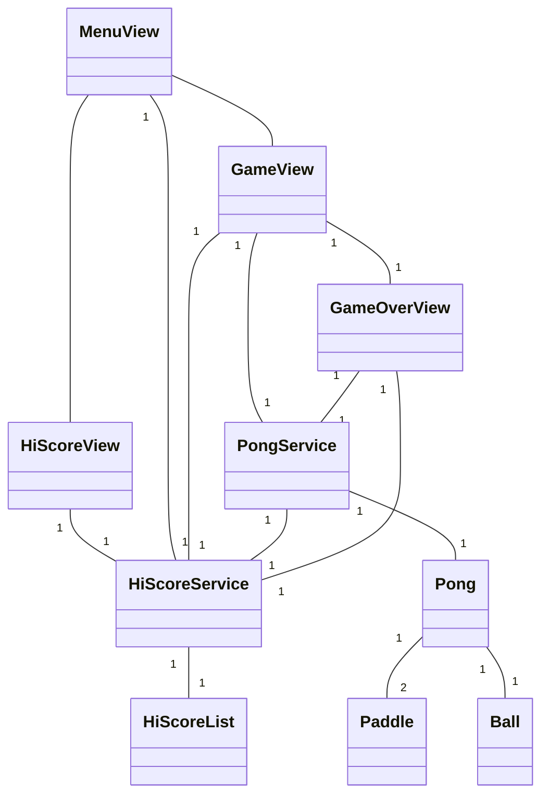
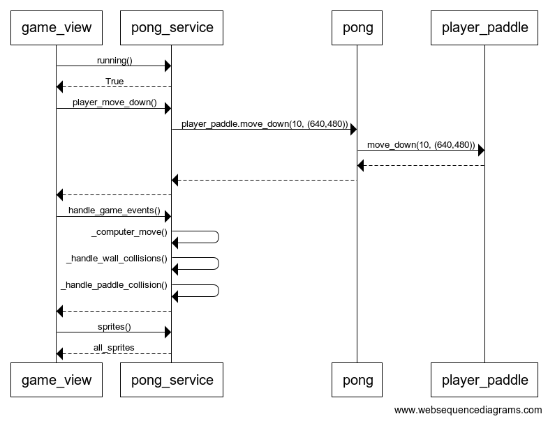

# Arkkitehtuurikuvaus

## Ohjelman rakenne

Ohjelman rakenne on kaksitasoinen, mikä ilmenee alla olevasta pakkauskaaviosta. Käyttöliittymän sisältävät luokat ovat pakkauksessa *ui*. Sovelluslogiikan muodostavat pakkaukset *services* ja *entities*, joista jälkimmäinen sisältää sovelluksen tietosisällön ja ensin mainittu tietosisältöä muokkaavan koodin. Käyttöliittymästä kutsutana ainoastaan *services*-pakkauksen luokkia.

## Käyttöliittymä

Käyttöliittymä on toteutettu pygame-kirjaston avulla. Käyttäjä ohjaa sovellusta näppäimistöllä. Sovelluksen käyttöliittymässä on neljä erilaista näkymää:

* päävalikko
* varsinainen pelinäkymä
* pelin lopetusnäkymä
* pistelista

Käyttöliittymä kutsuu ainoastaan *services*-pakkauksen luokkien *PongService* ja *HiScoreService* Jokainen käyttöliittymän näkymä on toteutettu omana luokkanaan, johon perustuva olio luodaan näkymää käynnistettäessä. Käyttöliittymän päävalikosta vastaava MenuView-olio vastaa muiden näkymien olioiden luomisesta, ja muiden olioiden metodien suorituksen jälkeen ohjelman suoritus palautuu päävalikkoon. Päävalikosta käynnistettäessä peliä siirrytään pelinäkymään. Pelinäkymästä poistuttaessa siirrytään pelin lopetusnäkymään, josta edelleen palataan päävalikkoon. Päävalikosta pääsee myös pistelistanäkymään, josta palataan päävalikkoon.

## Käyttöliittymän ja sovelluslogiikan luokkien suhde

Ohjelman valikko ja muut näkymät on toteutettu omina luokkinaan. Pelin tietosisältö on luokissa Pong, Paddle ja Ball, joiden tietoja luokka PongService lukee ja muokkaa. PongService-luokka tarjoaa metodit, joilla käyttöliittymäluokasta GameView ohjataan pelaajan mailaa sekä haetaan tiedot pelin tilasta. PongService-luokka huolehtii myös tietokoneen mailan ja pallon liikuttamisesta. HiScoreService-luokka huolehtii HiScoreList-luokan sisältämän pistelistan tallentamisesta ohjelman suorituksen aikana.

Alla on esitetty ohjelman luokkakaavio karkealla tasolla.

## Toiminnallisuudet

Alla oleva sekvenssikaavio kuvaa GameView-luokassa olevan pelisilmukan toimintaa yhden kierroksen aikana. Tässä esimerkissä pelaaja painaa nuolta alaspäin. Esimerkistä on luettavuuden takia jätetty pois tietokoneen mailan siirron ja pallon mahdollisten kimpoamisten yksityiskohtainen käsittely, sillä nämä sisältävät useita muuttujien arvojen lukemisia.

