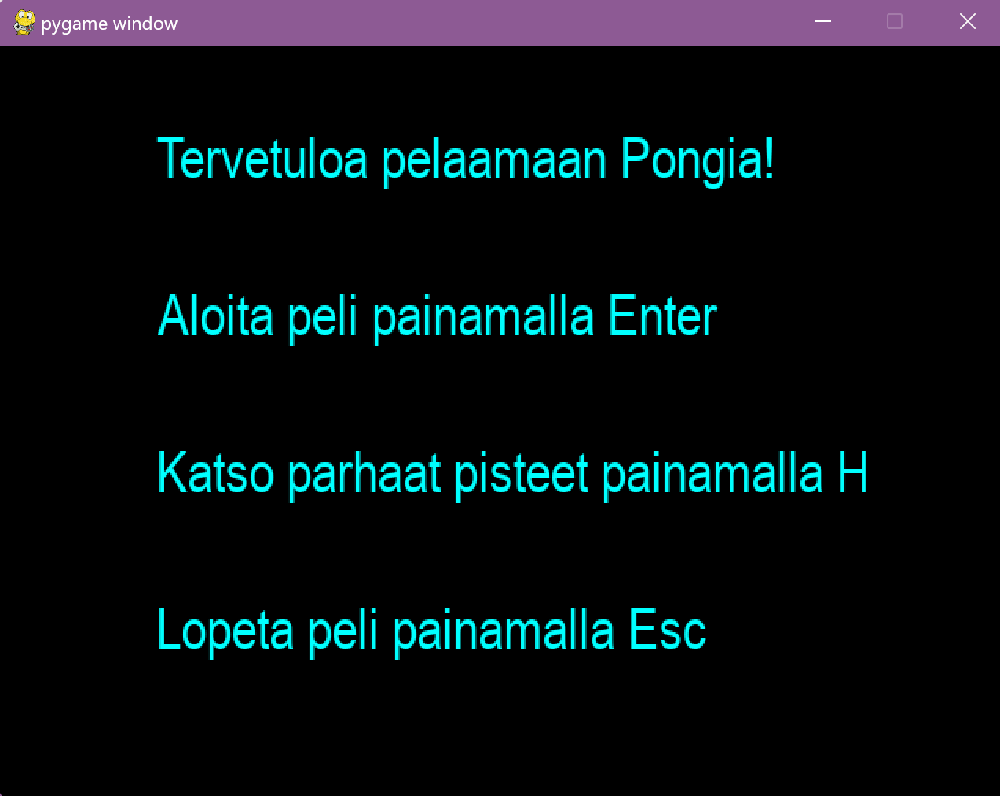
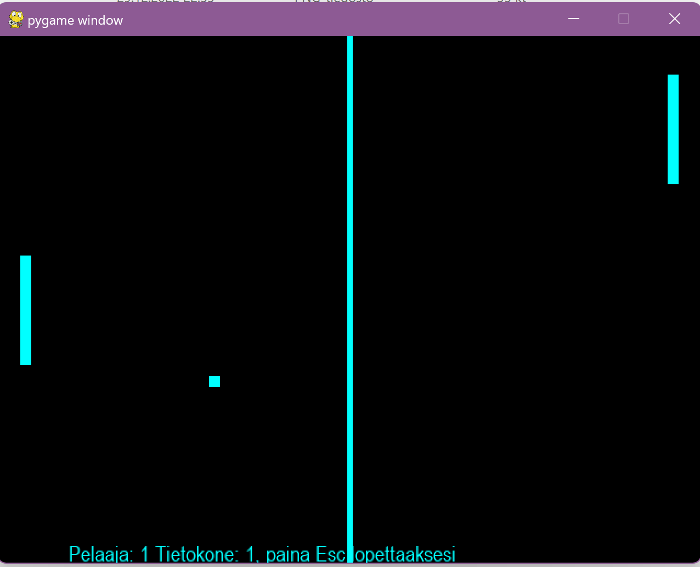
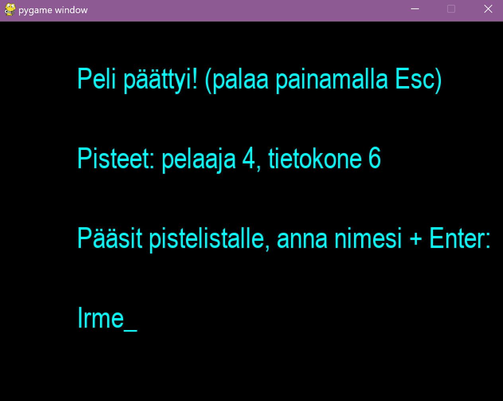
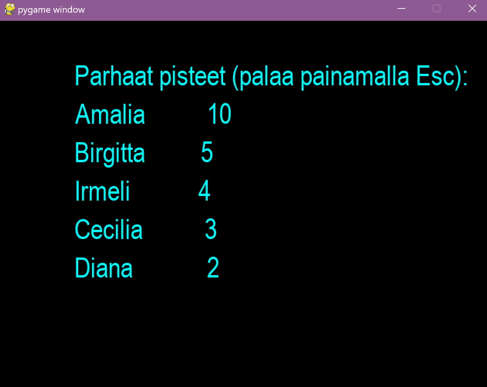

# Käyttöohje

Lataa viimeisin versio [Githubin repositorion releases -sivulta](https://github.com/jannelem/ot-harjoitustyo-sl22/releases)!

## Asentaminen ja käynnistys

Ennen kuin ohjelman voi käynnistää, tulee riippuvuudet asentaa komennolla
```bash
poetry install
```

Tämän jälkeen ohjelma käynnistyy komennolla
```bash
poetry run invoke start
```

## Päävalikko

Päävalikosta siirrytään käynnistetään peli tai siirrytään pistelistalle ohjeiden mukaisisilla näppäinkomennoilla.



## Pelaaminen

Kun peli on käynnistetty päävalikosta painamalla **Enter**, pelaajan maila näkyy vasemmalla ja tietokoneen maila oikealla. Pelaaja liikuttaa mailaa pystysuunnassa nuolinäppäimillä. Pallo kimpoaa seinistä ja mailoista. Pelaaja saa pisteen, kun pallo osuu ruudun oikeaan reunaan eli tietokoneen päätyyn. Vastaavasti tietokone saa pisteen pallon osuessa pelaajan päätyyn vasemmalla. Peli päättyy, kun tietokoneella ja pelaajalla on yhteensä 20 pistettä. Pelin voi myös keskeyttää painamalla **Esc**-näppäintä. 



Kannattaa varoa tilannetta, jossa pallo jää poukkoilemaan pelaajan mailan ja seinän väliin, sillä tällöin peli päättyy nopeasti tietokoneen voittoon! Toisaalta pelaajalle ropisee pisteitä nopeasti, mikäli vastaava tapahtuu tietokoneen päädyssä!

## Pelin päättyminen

Kun peli on päättynyt, näytössä näkyvät pelaajan ja tietokoneen pisteet. Jos pelaajan pisteet riittävät pistelistalle pääsyyn, samalla näytöllä ohjelma pyytää pelaajaa kirjoittamaan nimensä (nimi tallentuu painamalla **Enter**. Paluu päävalikkoon tapahtuu painamalla **Esc**-näppäintä. *Huom.! Jos tästä näytöstä poistutaan painamalla **Esc**, nimi ei tallennu pistelistalle!*



## Parhaat pisteet

Ohjelma tallentaa viiden parhaan pelaajan pisteet pistelistalle, johon pääsee päävalikosta painamalla näppäintä **H**. *Pistelistan pitkäaikaistallennusta ei vielä tässä versiossa ole.*


