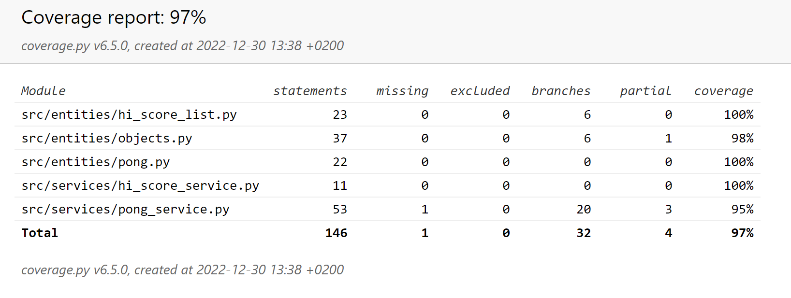

# Testausdokumentti

Peliä on testattu sekä yksittäisten metodien tasolla että integraatiotasolla unittestillä. Järjestelmätason testaus on tehty manuaalisesti pelaamalla peliä ja luomalla eri skenaarioita.

## Yksikkö- ja integraatiotestaus

# Sovelluslogiikka

Yksikkötason testejä on tehty etenkin objects-pakkauksen luokille ja metodeille, jotka vastaavat pelin tietosisällön ylläpitämisestä. Integraatiotasolla on testattu etenkin services-pakkauksen luokkia, jotka muokkaavat objects-pakkauksen luokista muodostettujen olioiden tietoja.

# Testikattavuus

Alla olevasta testikattavuusraportista nähdään, että sovelluslogiikka on testattu erittäin kattavasti.

