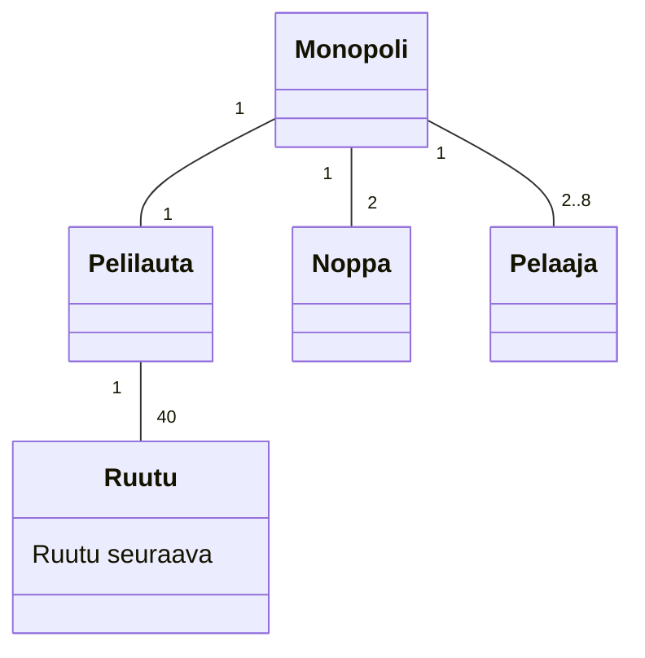
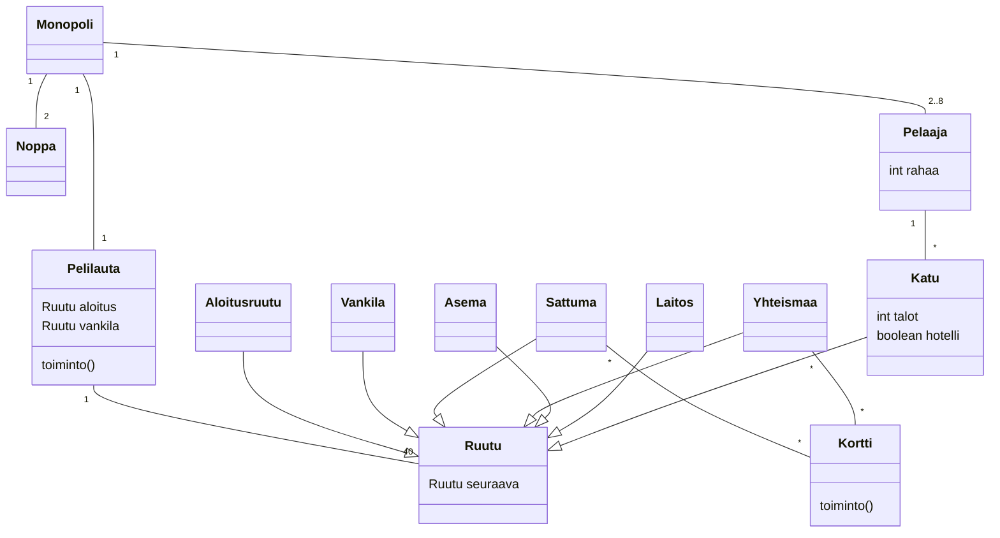
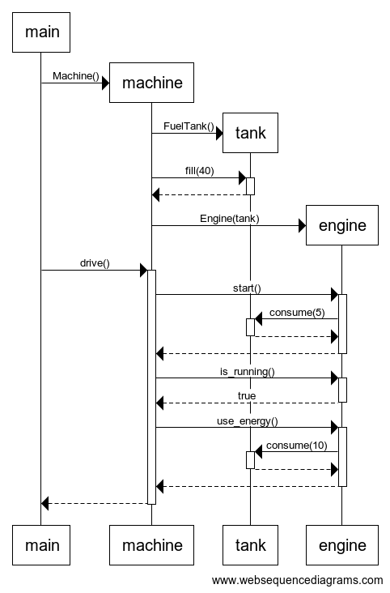
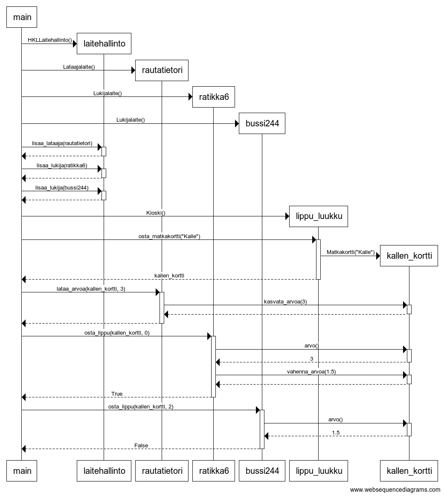

# Viikon 3 tehtävät

## Tehtävä 1

## Tehtävä 2

Huom.! En löytänyt konstia saada Mermaid-syntaksissa aikaan onttoa nuolta kuvaamaan perintää, joten tämän kaavion mustapäiset nuolet tulisi tulkita perinnäksi.

## Tehtävä 3

## Tehtävä 4

